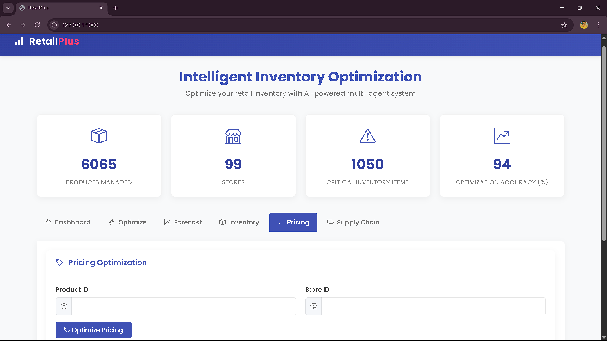

# RetailPlus: Retail Inventory Optimization with Multi-Agent AI

This project implements a multi-agent AI system for optimizing retail inventory management. It uses specialized agents to collaborate and provide comprehensive inventory optimization recommendations with an intuitive web-based dashboard.

## Overview

The system consists of four specialized agents and one coordinator agent:

1. **Demand Forecast Agent**: Predicts future demand for products using historical sales data.
2. **Inventory Monitor Agent**: Monitors inventory levels and identifies potential stockout or overstock issues.
3. **Pricing Optimization Agent**: Recommends optimal pricing strategies based on inventory, demand, and market conditions.
4. **Supply Chain Agent**: Provides supply chain recommendations including order quantities and frequencies.
5. **Coordinator Agent**: Orchestrates the specialized agents and generates comprehensive optimization plans.

The system uses SQLite for data storage and an Ollama LLM (qwen2.5:0.5b) running at http://35.154.211.247:11434 for intelligent decision-making.

## Features

- **Comprehensive Inventory Optimization**: Generates holistic recommendations by integrating demand forecasting, pricing strategy, and supply chain management.
- **Interactive Web Dashboard**: User-friendly interface with visualizations and real-time analytics.
- **Visual Analytics**: Charts and graphs for demand forecasting and performance trends.
- **Real-time Optimization**: Provides immediate feedback and recommendations based on current inventory data.
- **Robust Error Handling**: Fallback mechanisms to ensure reliable recommendations even with LLM service limitations.
- **JSON Formatting & Standardization**: Advanced preprocessing to ensure consistent data formats between API and frontend.
- **Responsive UI Design**: Modern interface that works across devices.

## Usage

### Running the System

1. First, ensure the Ollama LLM is accessible at http://35.154.211.247:11434

2. Initialize the database with sample data:
   ```bash
   python create_database.py
   ```

3. Run the main optimization example:
   ```bash
   python main.py
   ```

4. Start the API server with web UI:
   ```bash
   python api_server.py
   ```
   Then access the web UI at http://localhost:5000

### API Endpoints

The following API endpoints are available:

- `GET /api/health`: Check the API health
- `GET /api/products`: Get a list of products
- `GET /api/top-products?limit=N`: Get top N products by sales volume
- `GET /api/critical-inventory?limit=N`: Get N products with critical inventory levels
- `GET /api/dashboard-stats`: Get summary statistics for dashboard display
- `POST /api/optimize`: Optimize inventory for a specific product and store
- `POST /api/forecast`: Generate demand forecast for a specific product and store
- `POST /api/inventory-status`: Get inventory status for a specific product and store
- `POST /api/pricing`: Get pricing recommendations for a specific product and store
- `POST /api/supply-chain`: Get supply chain recommendations for a specific product and store

## Architecture

### Multi-Agent System

The system implements a collaborative multi-agent architecture where each agent specializes in a specific aspect of inventory management:

1. The **Demand Forecast Agent** analyzes historical sales data, seasonal patterns, and external factors to predict future demand.

2. The **Inventory Monitor Agent** tracks current inventory levels, monitors stockout risks, and recommends appropriate inventory levels.

3. The **Pricing Optimization Agent** suggests optimal pricing strategies based on inventory levels, competitor prices, and demand elasticity.

4. The **Supply Chain Agent** optimizes order quantities, frequencies, and supplier relationships to ensure efficient supply chain operations.

5. The **Coordinator Agent** integrates recommendations from all specialized agents to create a comprehensive optimization plan.

### Data Processing

The system includes a robust `RetailDataProcessor` class that:

- Validates dataset structure and identifies essential retail inventory fields
- Generates summary statistics for both numeric and categorical data
- Checks for data quality issues like missing values and duplicates
- Creates visualizations for basic data insights
- Exports processed data in standardized formats

### Database Schema

The system uses a SQLite database with three main tables:

- `demand_forecasting`: Historical sales data, including quantities, prices, and trends
- `inventory_monitoring`: Inventory levels, stockout frequency, supplier lead times, etc.
- `pricing_optimization`: Pricing data, competitor prices, elasticity information, etc.

## Technical Improvements

- **Enhanced JSON Processing**: Improved data formatting for consistent display between backend and frontend.
- **Standardized Field Handling**: Intelligent mapping between different field names and formats.
- **Projected Impact Visualization**: Color-coded metrics that adapt to positive/negative values.
- **Responsive Chart Rendering**: Dynamic chart generation based on available data formats.
- **Fallback Mechanisms**: Graceful degradation when API services are limited.

## Dependencies

- Python 3.8+
- Flask 2.3.2
- SQLite
- Pandas 2.0.1
- Requests 2.31.0
- Matplotlib 3.7.1
- Numpy 1.24.3
- Ollama LLM (qwen2.5:0.5b)

## Output

The web interface provides:

- **Dashboard Overview**: Summary statistics of products, stores, and critical inventory items.
- **Optimization Tool**: Input product and store IDs to receive AI-powered optimization recommendations.
- **Demand Forecasting**: Visual forecasts with trend analysis and confidence levels.
- **Inventory Status**: Real-time inventory level monitoring with status indicators.
- **Pricing Optimization**: Intelligent pricing recommendations with elasticity assessments.
- **Supply Chain Management**: Order quantity recommendations and supplier relationship insights.

## User Interface

- Dashboard


- Optimize Inventory


- Generate Forecast


- Check Inventory Status


- Optimize Pricing




- Get Supply Chain Recommendations


## License

MIT License - See LICENSE file for details
